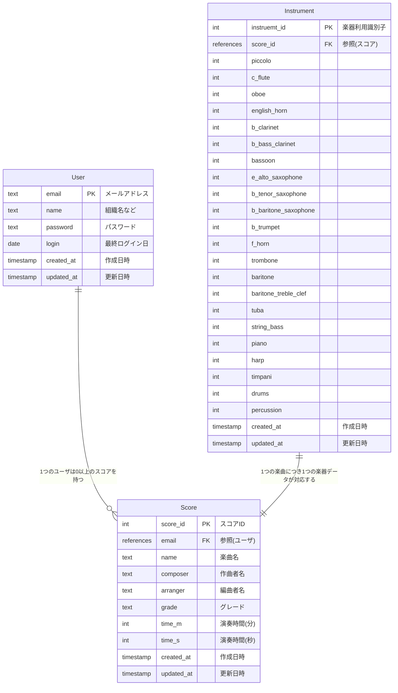

```mermaid
erDiagram
	User ||--o{ Score : "1つのユーザは0以上のスコアを持つ"
	Instrument ||--|| Score : "1つの楽曲につき1つの楽器データが対応する"
	User {
		text email PK "メールアドレス"
		text name "組織名など"
		text password "パスワード"
		date login "最終ログイン日"
		timestamp created_at "作成日時"
    timestamp updated_at "更新日時"
	}
	
	Score {
		int score_id PK "スコアID"
		references email FK "参照(ユーザ)"
		text name "楽曲名"
		text composer "作曲者名"
		text arranger "編曲者名"
		text grade "グレード"
		int time_m "演奏時間(分)"
		int time_s "演奏時間(秒)"
		timestamp created_at "作成日時"
    timestamp updated_at "更新日時"
	}
	
Instrument {
	int instruemt_id PK "楽器利用識別子"
	references score_id FK "参照(スコア)"
	int piccolo
	int c_flute
	int oboe
	int english_horn
	int b_clarinet
	int b_bass_clarinet
	int bassoon
	int e_alto_saxophone
	int b_tenor_saxophone
	int b_baritone_saxophone
	int b_trumpet
	int f_horn
	int trombone
	int baritone
	int baritone_treble_clef
	int tuba
	int string_bass
	int piano
	int harp
	int timpani
	int drums
	int percussion
	timestamp created_at "作成日時"
  timestamp updated_at "更新日時"
}
```